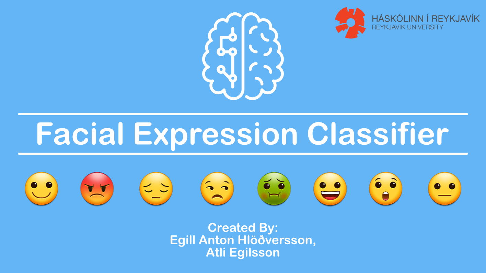

# facial-expression-classifier
### Introduction to Deep Learning
#### SC-  T-796-DEEP, Introduction to Deep Learning, 2018-3

A facial expression classifier that recognizes 8 common emotions: happy, angry, sad, contemptuous, disgusted, fearful, surprised, and neutral

## Table of Contents
1. [Introduction](#1-introduction)
2. [The Database](#2-the-database)
3. [The Model](#3-the-model)
4. [Model Validation](#4-model-validation)
6. [Authors](#5-authors)
8. [License](#6-license)
7. [References](#7-references)

## 1 Introduction

## 2 The Database

## 3 The Model

## 4 Model Validation

## 5 Authors
* [Atli Egilsson](https://github.com/atliegils) - MSc. Computer Science Student
* [Egill Anton Hlöðversson](https://github.com/egillanton) - MSc. Language Technology Student

## 6 License
This project is licensed under the MIT License - see the [LICENSE.md](LICENSE.md) file for details.

## 7 References
* [Radboud Faces Database](http://www.socsci.ru.nl:8180/RaFD2/RaFD?p=main)
* [Keras](https://keras.io)
