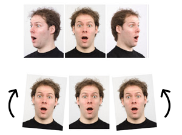

<i>
  Final Project  
  SC-T-796-DEEP, Introduction to Deep Learning, 2018-3  
  Reykjavík University - School of Computer Science, Menntavegi 1, IS-101 Reykjavík, Iceland
</i>

A facial expression classifier that recognizes 8 common emotions:  happy, angry, sad, contemptuous, disgusted, fearful, surprised, and neutral.

## Table of Contents
<!-- ⛔️ MD-MAGIC-EXAMPLE:START (TOC:collapse=true&collapseText=Click to expand) -->

Click to expand

1. [Introduction](#1-introduction)
2. [The Database](#2-the-database)
    * [The Augmented Dataset](#21-the-augmented-dataset)
    * [The Training And Test Set](#22-the-training-and-testing-set)
3. [The Model](#3-the-model)
    * [AlexNet](#31-alexnet)
    * [Custom Model](#32-custom-model)
4. [Model Validation](#4-model-comparison)
6. [Authors](#5-authors)
8. [License](#6-license)
7. [References](#7-references)

<!-- ⛔️ MD-MAGIC-EXAMPLE:END -->

## 1 Introduction
Facial emotion/expression classifier can be used to predict what a person is feeling from just looking at an image of a person. Even though a person can express countless expression, in this project we create a classifier that can distinguish between 8 common emotions: happy, angry, sad, contemptuous, disgusted, fearful, surprised, and neutral. The goal is to present a statistical comparison between several convolutional neural network (CNN) model architectures to measure their performances.

## 2 The Dataset
The dataset that was chosen was the **RaFD image set** from the **Radboud Faces Database**.

In total, the set contains 67 models:
* 20 Caucasian male adults
* 19 Caucasian female adults
* 4 Caucasian male children
* 6 Caucasian female children
* 18 Moroccan male adults

Each model was trained by a FACS (Facial Action Coding System) coder, to show each of the following emotional expressions:
* happy
* angry
* sad
* contemptuous
* disgusted
* neutral
* fearful
* surprised

Each emotion was shown with three different gaze directions (without changing head orientation):
* looking left
* looking frontal
* looking right

Further, each picture was taken from five different camera angles simultaneously:

Summary:
* 2.400 images of Caucasian male adults
* 2.280 images of Caucasian female adults
* 480 images of Caucasian male children
* 720 images of Caucasian female children
* 2.160 images of Moroccan male adults

**Total Images: 8.040**

### 2.1 The Augmented Dataset
After several attemption using the entire **RaFD image set**,  It was noticeable difficult to train a model that had to classify the pictures of the models sideways from 90°. A decision was made to try again, but without them. By reducing the dataset to only 4824 images, we faced with a challenge of having  to few records within out training set. For that reason a decision made to augment the images within the training set by make three additional variance of each image, by:

* Horizontal flipping the image
* Rotating the image 5° clockwise
* Rotating the image 5° anticlockwise

### 2.2 The Training And Test Set

Whenever training a model with supervised learning, there is a need to split the Dataset into two separated sets. One for training the model, and other to validate the performance of the model based on unseen data.

There are 67 Models within the dataset, and we decided for the training set to augment it so it would increase the size by four. So to have avoid having the test set to small in ratio in comparison to the training set; we started of by separate the models into two nearly equal separated sets, of 33 models and 34 models to the training and test set, respectably.

So now the test set consisted of 2.448 images of models that is completely unknown to the model.
As we mentioned above we want to increase the size of the training set by augmenting its images. So for training the model, a training set of  9.504 images is used.

**Summary:**
* Training Set: 33 Random Models - 9504 Images (80%)
* Test Set: 34 Remaining Models - 2448 Images (20%)

**Total Images: 11.952**

## 3 The Model

### 3.1 AlexNet

### 3.2 Custom Model

## 4 Model Comparison

## 5 Authors
* [Atli Egilsson](https://github.com/atliegils) - MSc. Computer Science Student
* [Egill Anton Hlöðversson](https://github.com/egillanton) - MSc. Language Technology Student

## 6 License
This project is licensed under the MIT License - see the [LICENSE](LICENSE) file for details.

## 7 References
* [Radboud Faces Database](http://www.socsci.ru.nl:8180/RaFD2/RaFD?p=main)
* [Keras](https://keras.io)

🌟 PLEASE STAR THIS REPO IF YOU FOUND SOMETHING INTERESTING 🌟

